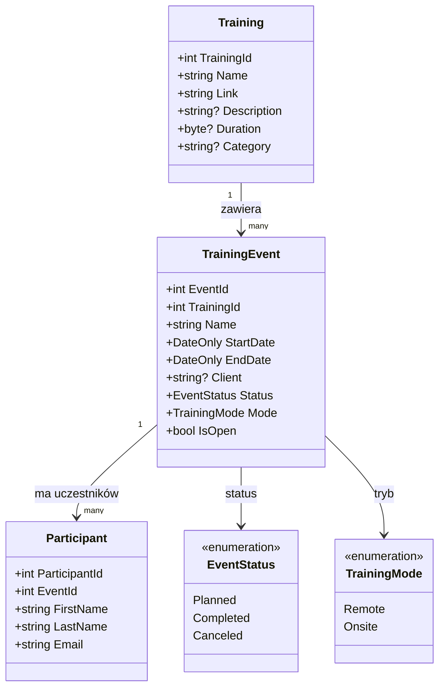

## Diagram klas

```mermaid
classDiagram
    %% ENUMS
    class EventStatus {
        <<enumeration>>
        Planned
        Completed
        Canceled
    }

    class TrainingMode {
        <<enumeration>>
        Remote
        Onsite
    }

    %% MAIN ENTITIES
    class Training {
        +int TrainingId
        +string Name
        +string Link
        +string? Description
        +byte? Duration
        +string? Category
    }

    class TrainingEvent {
        +int EventId
        +int TrainingId
        +string Name
        +DateOnly StartDate
        +DateOnly EndDate
        +string? Client
        +EventStatus Status
        +TrainingMode Mode
        +bool IsOpen
    }

    class Participant {
        +int ParticipantId
        +int EventId
        +string FirstName
        +string LastName
        +string Email
    }

    %% RELATIONSHIPS
    Training "1" --> "many" TrainingEvent : zawiera
    TrainingEvent "1" --> "many" Participant : ma uczestników
    TrainingEvent --> EventStatus : status
    TrainingEvent --> TrainingMode : tryb
```