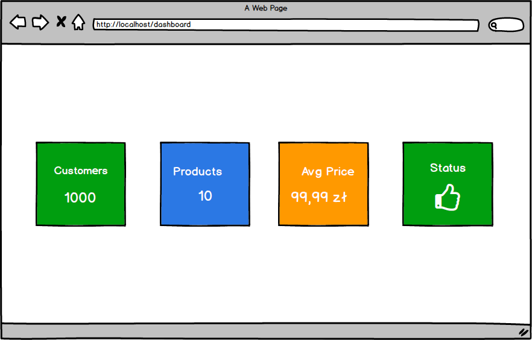

<file name=0 path=/Users/marcinsulecki/Projects/blazor-starter/excercises/dashboard-page.md># 📊 Task: Dashboard

## 🧩 Goal:
Your task is to create a reusable Blazor component (`InfoCard.razor`) that will serve as an element of a dashboard presenting key data – such as the number of customers, products, system status, etc.
The goal is to practice creating a reusable component.

## 🖼️ Sketch: 
  

---

## ✅ Functional Requirements:
1. **Component** `InfoCard.razor`
Create a component that displays the passed data in the form of an aesthetic "box".

Component parameters:
  - Title (string) – label of the information
  - Value (string or number) – main data
  - BackgroundColor (optional) – CSS class (e.g., bg-primary, bg-success, bg-warning)
  - Icon (optional) – emoji or icon from a library (e.g., 🛒, 👤, ✅)
  
Visual requirements:
- Rounded corners
- Shadow (box-shadow)
- Aesthetic layout ready to be used in a grid

2. **Page** `Dashboard.razor` 
Use the `InfoCard.razor` component at least four times with different data in a grid/flex layout

**Example cards:**
- 👤 Number of customers: `125`
- 🛒 Number of products: `58`
- 💰 Average product price: `48.90 zł`
- ✅ System status: `Online`

--- 

## 💡 Tips
- You can use Bootstrap (`bg-light`, `text-white`, `shadow-sm`, `rounded`) or your own CSS

### 👉 For designing the layout, the tool [`https://flexboxlabs.netlify.app`](https://flexboxlabs.netlify.app/) might be helpful 

---

## ⏱️ Estimated Time: **45 minutes**

If you have any questions — ask the trainer 🙂</file>